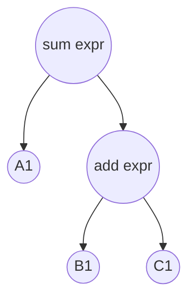

### currying

```js
const currying = (fn) => {
  const curried = (...args) => {
    if (args.length >= fn.length) {
      return fn(...args)
    }
    return (...args2) => curried(...args, ...args2)
  }
}
const sum = (a, b, c) => a + b + c
const add = currying(sum)
add(1)(2)(3) // 6
// currying 还可以接受第二个参数显示表示目标函数需要柯里化几层
```

### bind

```js
if (!Function.prototype.bind) {
  Function.prototype.bind = function (thisArg, ...argsArray) {
    if (typeof this !== 'function') {
      throw new Error('what trying to be bound is not callable')
    }
    const fToBind = this
    const fBound = function (...args) {
      return fToBind.apply(
        // 《你不知道的 javascript》上是这么写的，但是我感觉应该要去掉 '&& thisArg'
        this instanceof fBound /* && thisArg */ ? this: thisArg,
        [...argsArray, ...args])
    }
    fBound.prototype = Object.create(fToBind.prototype)
    return fBound
  }
}

// 实际 polyfill 的版本见 https://github.com/zloirock/core-js/blob/master/packages/core-js/internals/function-bind.js
```

### 寄生组合式继承

```js
function Animal(name) {
  this.name = name
}
Animal.prototype.eat = function() {
  console.log('eat')
}
function Dog(name) {
  Parent.call(this, name)
}

// es6
Dog.prototype = Object.create(Animal.prototype)

// es5 
const fNOP = function(){}
fNOP.prototype = Animal.prototype
Dog.prototype = new fNOP()
```

### cloneDeep

```js
// 部分伪代码，部分仅写下思路，未具体实现
function cloneDeep(value) {
	return baseClone(value)
}
/**
 * @param {*} [value] The value to clone.
 * @param {Map} [map] Tracks traversed objects and their clone counter parts.
 */
function baseClone(value, map) {
  // 普通值类型
  if (!isObject(value)) {
    return value
  }
  
  // 初始化深拷贝的对象（先生成一个同类型对象）
  let result
  const isArr = Array.isArray(value)
  if (isArr) {
    result = initCloneArray(value) // 最简单的情况就是 new Array(value.length)
  } else {
    // 通过内省找出对象的类型，最常见的内省方法是 toString 或 instanceof
    const tag = getTag(value)
    const isFunc = tag === funcTag || tag === genTag
    if (tag === objectTag || tag === argsTag || isFunc) {
      result = isFunc ? {} : initCloneObject(value)
    } else {
      // 这里其实有特殊情况，比如 error/function/weakMap 类型都是 uncloneabled
      result = initCloneByTag(value, tag)
    }
  }
  
  // check for circular references
  map || (map = new Map())
  if (map.has(value)) {
    return map.get(value)
  }
  map.set(value, result)
  
  // 以下是对初始化好的对象内容克隆的过程
  // 不同类型的对象 subValue 的赋值方式不同
  // set 和 map
  if (isSet(value)) {
    value.forEach(subValue => result.add(baseClone(subValue, map)))
  } else if (isMap(value)) {
    value.forEach((subValue, key) => result.set(key, baseClone(subValue, map)))
  }
  // 数组和其他对象可以先转成键值数组，遍历赋值
  // 这个过程其实比较复杂，因为不只是可枚举属性，对象上的各种 symbols、访问描述符之类的都要考虑进去
  // 可枚举属性可以用 Object.keys, symbols 可以用 getOwnPropertySymbols，处理后放到同一个数组中遍历处理
  // 这里只写 Object.keys 的情况
  Object.keys(value).forEach(key => {
    // assign value 的过程也有特殊情况，这里暂不考虑
    result[key] = baseClone(value[key], map)
  })
  
  return result
}

function isObject(value) {
  const type = typeof value
  return value != null && (type === 'object' || type === 'function')
}

function getTag(value) {
  // lodash 源码中对有 Symbol.toStringTag 接口的对象有额外处理，还没搞明白是为什么
  return Object.prototype.toString.call(value)
}

function initCloneObject(object) {
  return Object.create(Object.getPrototypeof(object))
}

function initCloneByTag(object, tag) {
  const Ctor = object.constructor
  switch (tag) {
    // 本质上都是调用构造器初始化一个新对象，但是不同类型构造器接受的参数不同，有的类型可能需要一些额外的处理
    case arrayBufferTag:
      return cloneArrayBuffer(object)
    case boolTag:
    case dateTag:
      return new Ctor(+object)
    // 其他各种 case 比如 dateViewTag，各类 TypedArray，比较复杂
      
    // map 和 set，返回构造器本身即可
    // return new Ctor
      
    // 又比如 RegExp、Symbol 都有对应的处理方法
    // symbol 通过 Object(Symbol.prototypeof.valueof.call(symbol)) 实现
      
    // 基础类型使用构造方法的情况也要考虑进去，比如 new Number(1), new String('foo')
    // return new Ctor(object)
  }
}
```

### EventEmitter

```js
class EventEmitter {
	events = {}
  
  on(eventName, callback) {
    this.events[eventName] = this.events[eventName] ?? []
    this.events[eventName].push(callback)
    return this
  }
  
  off(eventName, callback) {
    const eventCallbacks = this.events[eventName]
    if (eventCallbacks) {
      this.events[eventName] = eventCallbacks.filter(fn => fn !== callback)
    }
    return this
  }
  
  emit(eventname, ...args) {
    const eventCallbacks = this.events[eventName]
    if (eventCallbacks) {
      eventCallbacks.forEach(fn => {{
        fn.apply(this, args)
      }})
    }
  }
  
  once(eventname, callback) {
    const wrapped = (...args) => {
      callback.apply(this, args)
      this.off(eventname, wrapped)
    }
    this.on(eventName, wrapped)
  }
}
```

### Array.prototype.flat

```js
// https://developer.mozilla.org/zh-CN/docs/Web/JavaScript/Reference/Global_Objects/Array/flat

// reduce recursively
function flatDeep(arr, depth = 1) {
  return depth > 0
    ? arr.reduce(
        (acc, next) =>
          acc.concat(Array.isArray(next) ? flatDeep(arr, --depth) : next),
        []
      )
    : arr.slice();
}

// generator
function* flatten(arr) {
  for(const item of arr) {
    if(Array.isArray(item)){
      yield* flatten(item)
    } else {
      yield item
    }
  }
}

const arr = [[1,2,3],4,[5,[6,[7,8]]]]
const flattened = [...flatten(arr)]
```

### 实现一个控制并发数的 fetch 请求

```js
// promise 问题在我面试中是高频方向，其中控制并发、prototype 上的一系列方法的手写实现或变种问题都有涉及（.race .all .allsettled 等）

// 下面是函数式实现，用类实现同理，而且应该写起来更明白些
function maxConcurrencyFetch(maxConcurrency) {
  // 队列中的任务
  const queue = [];
  // 当前 pending 中的任务数
  let count = 0;

  const peekTask = () => queue.shift();
  const doTask = async (...args) => {
    count++;
    const response = await fetch(...args);
    count--;
    const nextTask = peekTask();
    nextTask?.();
    return response;
  };

  const myFetch = (...args) => {
    if (count < maxConcurrency) {
      return doTask(...args);
    }
    return new Promise((resolve) => {
      queue.push(async () => {
        resolve(await doTask(...args))
      });
    });
  };

  return myFetch;
}

const myFetch = maxConcurrencyFetch(3);
myFetch("/api/v1/users");
myFetch("/api/v1/users");
myFetch("/api/v1/users");
myFetch("/api/v1/users"); // should wait in queue, launch when at least one task finished

```

### 手写 promise 实现

```js
// 也是个很复杂的问题，面试实际不知道会不会遇到让写完整个符合 promise A+ 规范的实现
// 不过练习的时候写一遍，至少可以说出 promise 实现的思路，而且会覆盖到诸如实现 Promise.race 的实现这样的子问题
```

promisify

```js
// 看别人的面经有问到
```

react hook 相关的手写题（比如 counter 的各种变种，useTimeout 之类的 custom hook）

```js
// 比较常规，不予实现，面试中共遇到过两次，都是小厂问的
```

### 虚拟滚动列表

```js
// 字节某部门一面遇到，能用伪代码实现体现原理即可
// 后续的提问点可能在对于列表项高度不确定怎么办，如何对列表项缓存
```

excel 表格函数执行 = SUM(A1, ADD(B1, C1))  (脉脉看到有人飞书二面的题)

```js
// 直觉上思路是 parse 成语法树后，后序遍历节点，通过一个操作数栈去记录计算值
// 比如对于 SUM(A1, ADD(B1, C1)), 伪代码

const listener = new Listener()
walk(tree, listener)
const output = listener.operandStack.pop()

// otherFile.js
class Listener {
  operandStack = []
  
  enterNum(ctx){
    this.operandStack.push(ctx.value)
  }
  enterSumExpr(ctx) {
   	//...
  }
  enterAddExpr(ctx) {
    const secondVal = this.operandStack.pop()
    const firstVal = this.operandStack.pop()
    const exprValue = firstVal + secondVal
    this.operandStack.push(exprValue)
  }
}
```





---

吐槽一下算法题。应对算法需要系统学习+长周期大量联系，但是面试时又不一定考察（我面的两面字节都没有考察，只有外企小厂出了一题简单题）。即使刷题了，能不能碰着做过的题，做过的题的 coding 还熟不熟练也都是未知。总的来说，投入巨大但收益不确定。

感觉如果在其他复习完备之外，没有大量时间和长周期刷题的话，算法只能刷个力扣 top 100 或者剑指。面试中算法题难易不等，简单的像最常规的贪心和动态规划，各种排序，常规的各种数据结构的各种操作。

到中等难度就感觉有点碰运气了，看有没有做过，有思路的情况下 coding 的状态如何，可以做一些高频题比如 全排列/top K，也看到有前端面试被问到过 manacher/kmp/morris  之类的常见的算法（但是临场 coding 有难度）。

至于困难题，其他复习点没万全的话还是战略放弃好了。

---

再补充一个特殊点的手写门类，系统设计题。这类题很少遇到（外企高频），但是如果对这个门类毫无了解的话，突然被问到可能会大脑宕机。

面试外企时有准备，但是没遇到，不过大厂的二三面也有可能会遇到类似的题，比如一个具体的业务场景，你会怎么去实现功能。

这种题还是比较有意思的，不仅考察思路，也需要和面试官积极交流。通常按以下步骤：

- 理解和讨论需求，明确要实现的需求重点和一些量化细节
- 数据字典（模型设计/表设计）
- 接口设计
- 组件设计
- *一些特殊的需求（分布式之类的，但是感觉前端能讲个大概就可以了，我只简单了解了下 CAP 原则、一致性哈希算法之类的概念）

可以搜一下常见的例题，比如 facebook news feed、short url

